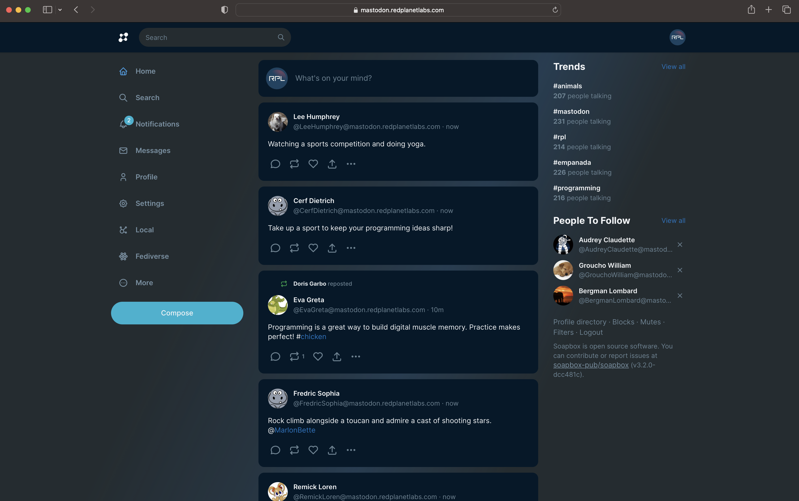
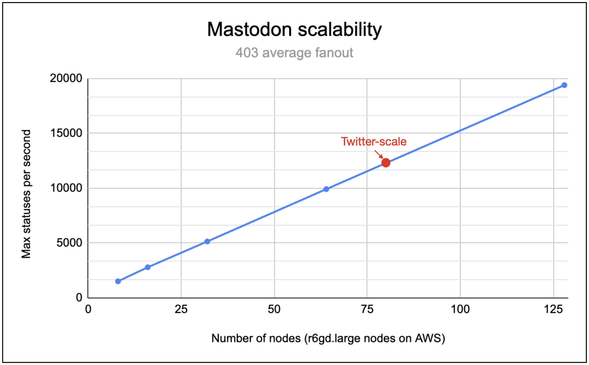
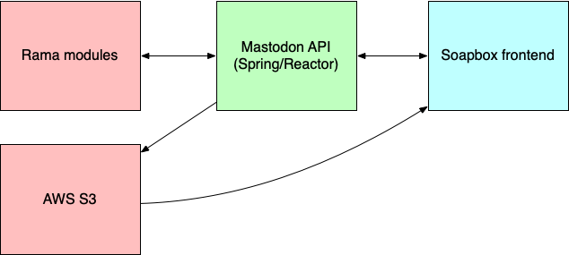

# twitter-scale-mastodon



This project is a production-ready implementation of a Mastodon instance that scales to Twitter-scale (500M users, 700 average fanout, unbalanced social graph, 7k posts / second). It's only 10k lines of code and can easily be adapted into any Twitter-like social network. It shares no code with the [official Mastodon implementation](https://github.com/mastodon/mastodon).

The implementation is built on top of [Rama](https://redplanetlabs.com/), a new programming platform that enables end-to-end scalable backends to be built in their entirety in 100x less code than otherwise. Rama is a generic platform for building any application backend, not just social networks. This project is a demonstration of Rama's power. We will be starting a [private beta](https://docs.google.com/forms/d/e/1FAIpQLSfrhmBwI0YAeaL8u4XmgfscW4UIUUDp2ZHSs4KmPH_TaDt1QQ/viewform) for Rama soon, and a build of Rama is freely available to [try now](https://redplanetlabs.com/docs/~/downloads-maven-local-dev.html).

We ran this code on a public instance available for anyone to use from August 15th, 2023 to August 24th, 2023. To demonstrate its scale, we ran the instance with 100M bots posting 3,500 times per second at 403 average fanout. The social graph was extremely unbalanced, with the largest user having 22M followers. During its lifetime the instance processed 2.66B posts and made 1.07T timeline deliveries.

Here's a chart showing the scalability of the implementation:



You can read a deep-dive exploration of how this instance is implemented in [this blog post](https://blog.redplanetlabs.com/2023/08/15/how-we-reduced-the-cost-of-building-twitter-at-twitter-scale-by-100x/). That post also includes other performance charts.

## Implementation overview

The implementation is structured like this:



The Mastodon backend is implemented as Rama modules, which handle all the data processing, data indexing, and most of the product logic. On top of that is the implementation of the [Mastodon API](https://docs.joinmastodon.org/api/) using Spring/Reactor. For the most part, the API implementation just handles HTTP requests with simple calls to the Rama modules and serves responses as JSON.

[S3](https://aws.amazon.com/s3/) is used only for serving pictures and videos. Though we could serve those from Rama, static content like that is better served via a [CDN](https://en.wikipedia.org/wiki/Content_delivery_network). So we chose to use S3 to mimic that sort of architecture. All other storage is handled by the Rama modules.

The backend is implemented in the [backend/](backend) folder and contains six modules:

- [Relationships](backend/src/main/java/com/rpl/mastodon/modules/Relationships.java): Implements the social graph, follow suggestions, and other relationships between entities.
- [Core](backend/src/main/java/com/rpl/mastodon/modules/Core.java): Implements timelines, profiles, fanout, boosts, favorites, conversations, replies, and the other core parts of the product.
- [Notifications](backend/src/main/java/com/rpl/mastodon/modules/Notifications.java): Implements notification timelines, including favorites/boosts, mentions, poll completion, new followers, and others.
- [TrendsAndHashtags](backend/src/main/java/com/rpl/mastodon/modules/TrendsAndHashtags.java): Implements trending statuses, links, and hashtags, as well as hashtag timelines and other hashtag-oriented features.
- [GlobalTimelines](backend/src/main/java/com/rpl/mastodon/modules/GlobalTimelines.java): Implements local and federated timelines of all statuses.
- [Search](backend/src/main/java/com/rpl/mastodon/modules/Search.java): Implements profile, status, and hashtag search, as well as profile directories.

The API server is implemented in the [api/](api) folder.

Federation is implemented in both the API server and the [Core](backend/src/main/java/com/rpl/mastodon/modules/Core.java) module.

## Running locally

Running the instance locally is easy. We've set up the API server to also be able run an in process cluster with all the modules launched. All you have to do is run this from the `api/` folder:

```
mvn spring-boot:run
```

Since this doesn't configure credentials to connect to S3, you'll see an error about that. That error is ignored and the instance will continue launching.

If you look at [MastodonApiApplication](api/src/main/java/com/rpl/mastodonapi/MastodonApiApplication.java), you can see how it also adds some data to the modules. These include users "alice", "bob", and "charlie" with passwords "alice", "bob", and "charlie" respectively.

To run the frontend, you'll need to run [our fork of Soapbox](https://github.com/redplanetlabs/soapbox). Our fork contains minor tweaks to the official implementation to fix a variety of small issues. From the root of that fork run:

```
NODE_ENV="development" BACKEND_URL="http://localhost:8080" yarn build
NODE_ENV="development" BACKEND_URL="http://localhost:8080" yarn dev --port 8000
```

Once everything finishes launching, you can play with the instance at [http://localhost:8000](http://localhost:8000).

Note that the instance can be run locally on macOS or Linux, but it doesn't currently work on Windows.

## Running on a real cluster

Until Rama is publicly available, the only way to get access to the full Rama release is by [applying](https://docs.google.com/forms/d/e/1FAIpQLSfrhmBwI0YAeaL8u4XmgfscW4UIUUDp2ZHSs4KmPH_TaDt1QQ/viewform) to our private beta.
